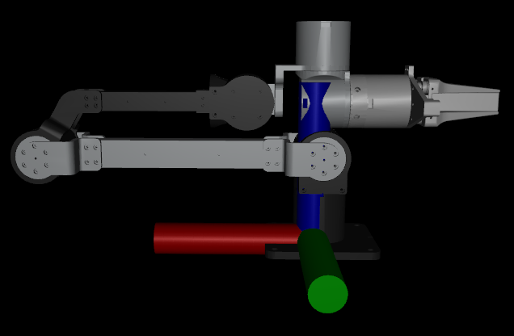

## 1.  简介

S1 机械臂 SDK 提供了控制机械臂运动、读取状态、执行正逆运动学等功能的 Python API。开发者可以使用本 SDK 轻松实现关节控制、末端控制、示教、碰撞检测等功能。

SDK 支持：

* 关节位置/速度/力矩控制

* 末端笛卡尔空间控制

* 正解 / 逆解（KDL Solver）

* 示教记录与回放

* 碰撞检测控制

* 夹爪控制

* 实时状态读取


## 2. 安装

### 2.1创建虚拟环境

使用 conda创建Python 3.10 虚拟环境，，conda的安装步骤见：

[miniconda安装](http://git.sylas.site:8081/Theseus/S1_SDK/src/branch/main/doc/conda_install.md)

```plain&#x20;text
conda create -y -n S1 python=3.10
```

然后激活环境，每次使用SDK时都需要这么做

```plain&#x20;text
conda activate S1
```

### 2.2 克隆仓库

在激活了环境之后，下载SDK源码

```plain&#x20;text
git clone https://github.com/YHRG-Robotics/S1_SDK.git
cd S1_arm/S1_SDK
```

### 2.3安装项目及依赖

在源码的S1\_SDK目录下执行：

```plain&#x20;text
pip install -e . -i https://pypi.tuna.tsinghua.edu.cn/simple
```

* 如果需要使用运动学正逆解功能，还需安装 PyKDL：

详细安装步骤见：

[运动学解算PyKDL安装](http://git.sylas.site:8081/Theseus/S1_SDK/src/branch/main/doc/kdl_install.md)

注意：

运动学坐标系为基坐标系，具体如图所示，红色为X轴正方向，绿色为Y轴正方向，蓝色为Z轴正方向。


## 3. SDK结构说明

```plain&#x20;text
.
│  .gitignore
│  readme.md ------------------------------------------#说明文档
│  version_updata.md ----------------------------------# 版本更新日志
│
├─doc
│  │  conda_install.md --------------------------------# conda环境安装
│  └─ kdl_install.md ----------------------------------# kdl安装
├─images
└─S1_SDK
    │  pyproject.toml
    │  README.md
    │
    ├─examples-----------------------------------------# 示例代码
    │      check_arm.py -------------------------------# 检查机械臂是否连接并检测当前已连接机械臂的端口
    │      collision.py -------------------------------# 自碰撞检测
    │      disable.py ---------------------------------# 失能
    │      enable.py ----------------------------------# 使能
    │      gravity.py ---------------------------------# 重力补偿
    │      keyborad_end_effect.py ---------------------# 键盘控制末端位姿
    │      keyborad_joint.py --------------------------# 键盘控制关节角度
    │      read_pos.py --------------------------------# 读取机械臂当前位置
    │      set_zero_position.py -----------------------# 设置机械臂零位
    │      set_zero_position_gripper.py ---------------# 单独设置夹爪零位
    │      set_zero_position_teach_gripper.py ---------# 单独设置示教夹爪零位
    │      teaching.py --------------------------------# 示教
    │      teleop_demo.py -----------------------------# 遥操作示例
    └─src
        └─S1_SDK
            │  base_mode.py
            │  only_real.py
            │  only_sim.py
            │  real_and_sim.py
            │  real_control_sim.py
            │  real_diff_sim.py
            │  S1_arm.py ------------------------------# 机械臂接口
            │  __init__.py
            ├─hardware---------------------------------# 硬件接口
            └─resource---------------------------------# 资源文件
```

* examples文件夹：

包含机械臂各个功能使用示例

* hardware文件夹

包含电机驱动，各功能的具体实现

* src文件夹

提供给用户的具体接口  


## 4. 快速开始

### 4.1 初始化机械臂

使用前需要导入机械臂的接口，因为在上面安装时已经安装到本地，所以可以在任意项目需要的地方使用：

```plain&#x20;text
from S1_SDK import S1_arm,control_mode
```

此时导入了机械臂SDK的读取与控制接口，控制模式，再实例化机械臂：

```plain&#x20;text
S1 = S1_arm(control_mode.only_real,dev="can0",end_effector="None")
```

此时可以初始化机械臂

参数说明：

1.control\_mode(SDK模式)：是否选择调用实体机械臂

2.dev(机械臂接口)：实体机械臂对应的设备端口号

3.end\_effector(末端执行器)：末端执行器类型，包括：None(无末端)、gripper(夹爪)、teach(示教器)

如上示例，选择选择仅实体机械臂，接口选择can0，末端选择无

### 4.2 机械臂控制模式

机械臂SDK有多种模式，主要模式包括单独控制真实机械臂的模式，单独控制仿真的模式，仿真和真实机械臂联动模式，真实机械臂控制仿真模式，详情可自行查看S1\_arm.py中的control\_mode

#### 4.2.1仅真实机械臂模式 (only\_real)

指定端口号可对真实机械臂进行控制

#### 4.2.2仅仿真模式(only\_sim)

创建对象之后会出现一个mujoco仿真页面，可通过SDK操控仿真页面里的机械臂，用于上实机之前验证控制是否安全（仅支持角度控制）

#### 4.2.3实机控制仿真模式(real\_control\_sim)

在仿真中会有机械臂的数字孪生，人去拖动现实的机械臂时，仿真页面里的机械臂也会随之移动

## 5. 状态读取

注意：机械臂的状态读取需要刷新才能正确更新，读取参数前需要调用：

```plain&#x20;text
from S1_SDK import S1_arm,control_mode
S1 = S1_arm(control_mode.only_sim,end_effector="None")
S1.refresh()
```

调用refresh()方法，可对机械臂状态进行更新

### 5.1 读取角度

```plain&#x20;text
from S1_SDK import S1_arm,control_mode
S1 = S1_arm(control_mode.only_sim,end_effector="None")
S1.refresh()
pos = S1.get_pos()
```

调用get\_pos()方法会返回当前的各个关节角度，单位为弧度值

### 5.2 读取力矩

```plain&#x20;text
from S1_SDK import S1_arm,control_mode
S1 = S1_arm(control_mode.only_real,end_effector="None")
S1.refresh()
tau = S1.get_tau()
```

调用get\_tau()方法会返回当前电机的各个关节角度的力矩，注：仅有实体电机模式会返回力矩

### 5.3 读取速度

```plain&#x20;text
from S1_SDK import S1_arm,control_mode
S1 = S1_arm(control_mode.only_real,end_effector="None")
S1.refresh()
vel = S1.get_vel()
```

调用get\_vel()方法会返回当前电机的各个关节角度的速度，注：仅有实体电机模式会返回速度

### 5.4 读取电机温度

```plain&#x20;text
from S1_SDK import S1_arm,control_mode
S1 = S1_arm(control_mode.only_real,end_effector="None")
S1.refresh()
temp_mos,temp_rot = S1.get_temp()
```

调用get\_temp()方法会返回当前电机的各个关节角度的 温度，注：仅有实体电机模式会返回温度

## 6. 机械臂控制

### 6.1 速度位置模式

该控制下，默认有机械臂的自碰撞检测功能，若需要关闭，可在对应的函数joint\_control下注释判断条件：

```python
if self.check_collision(pos):
    print(f"time:{time.time()} 碰撞检测到, 控制被阻止")
    return False
```

使用为：

joint\_control(pos)

pos为位置列表，对应各个关节的角度

```plain&#x20;text
from S1_SDK import S1_arm,control_mode
S1 = S1_arm(control_mode.only_real,end_effector="None")
S1.refresh()
pos = [0.0] * 6
S1.joint_control(pos)
```

### 6.2 MIT控制

该控制响应速度较高，使用时注意安全

joint\_control\_mit(pos)

pos为位置列表，对应各个关节的角度

```plain&#x20;text
from S1_SDK import S1_arm,control_mode
S1 = S1_arm(control_mode.only_real,end_effector="None")
S1.refresh()
pos = [0.0] * 6
S1.joint_control_mit(pos)
```

## 7. 机械臂功能

### 7.1 使能与失能

```plain&#x20;text
S1.enable() #使能
S1.disable() #失能
```

注意:使能后才能进行运动控制，失能会使机械臂失去力矩，使用时注意安全。

### 7.2 设置零位

```plain&#x20;text
S1.set_zero_position() #机械臂整理设置零位
S1.set_zero_position_gripper() #单独夹爪设置零位
```

注意：机械臂本体上有明确的零位位置，设置零位时需准确与本体上的零位对应，切勿在其他非零点位置设置零位，避免控制时发生危险。

若夹爪拆卸后重新安装，此时易混淆末端法兰的位置，建议重新设置零位。

### 7.3 关节角度控制

```plain&#x20;text
pos = [0,0,0,0,0,0]
S1.joint_control(pos)
```

此时直接传入机械臂的角度，机械臂运动到对应位置，注意方向。

### 7.4 机械臂末端控制

```plain&#x20;text
# 以下为四元数接口
end_pos_quat = [0, 0, 0.3, 0.5, 0.5, -0.5, -0.5]
pos = S1.end_effector_control(end_pos_quat)
# 以下为欧拉角接口
end_pos_euler = [0, 0, 0.3, -1.571, -0.000, 1.571]
pos = S1.end_effector_control_euler(end_pos_euler)
```

四元数接口的顺序为x, y, z, qx, qy, qz, qw

欧拉角顺序的接口为x, y, z, r, p, y

注意：

运动学坐标系为基坐标系，具体如图所示，红色为X轴正方向，绿色为Y轴正方向，蓝色为Z轴正方向。

由于逆解的无解和多解特征，在保证末端位姿下，其余各关节可能解算到突变的位姿，使用时需远离设备，避免发生危险。

<!--  -->

### 7.5 运动学正逆解

```plain&#x20;text
# 正解
pos = [0, 0, 0, 0, 0, 0]
pose_quat = S1.fk_quat(pos)

pose_euler = S1.fk_euler(pos)

# 逆解
pos_quat = S1.get_ik_quat(pose_quat)

pos_euler = S1.get_ik_euler(pose_euler)

```

注意区分四元数接口与欧拉角接口，接口顺序同上6.3节。

### 7.6 重力补偿

```plain&#x20;text
S1.gravity()
```

注意机械臂需要平稳放置于桌面上，否则易发生危险。

机械臂底座有开启重力补偿按钮，可以脱离上位机运行。

### 7.7 机械臂示教

```plain&#x20;text
机械臂SDK目录下的examples文件夹下含有示例：
python3 teaching.py
```

注意：该示例为带参数启动为记录模式，执行命令后添加任意参数，如 python3 teaching.py 1

不带参数启动为复现模式，示例： python3 teaching.py

机械臂底座上有轨迹记录与复现按钮，功能可脱离上位机运行。

### 7.8 夹爪控制

```plain&#x20;text
gripper_pos = 0.0
gripper_tau = 0.5
control_gipper(gripper_pos,gripper_tau)
```

夹爪的单独控制，使用时正常实例化带夹爪的对象，其他关节控制传机械臂六轴参数，

该夹爪函数为单独传参数控制，第一个参数为位置，第二个参数为最大力矩。

### 7.9 自碰撞检测

```plain&#x20;text
```


## 8 常见问题（FAQ）

待更新  


