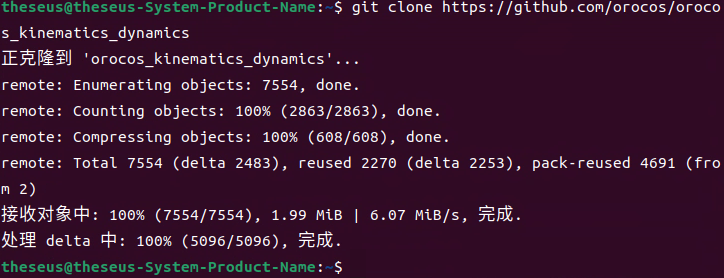
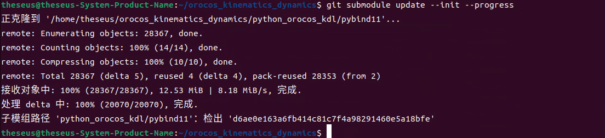
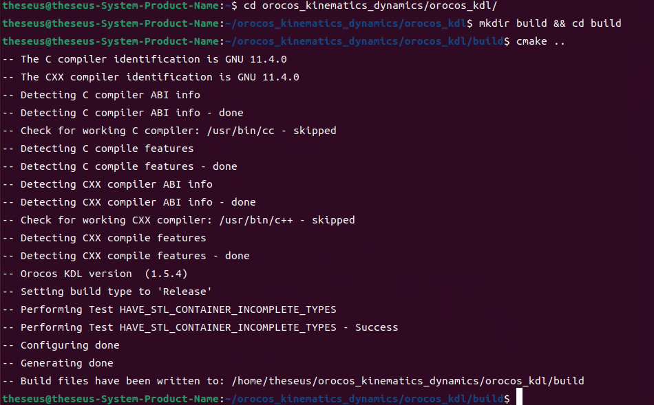
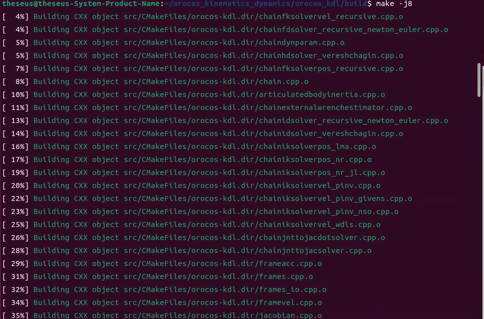
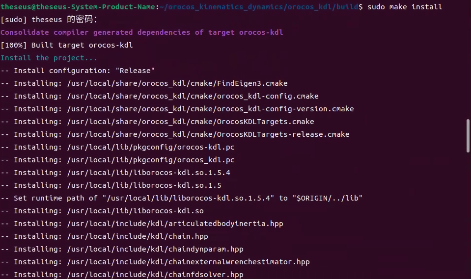
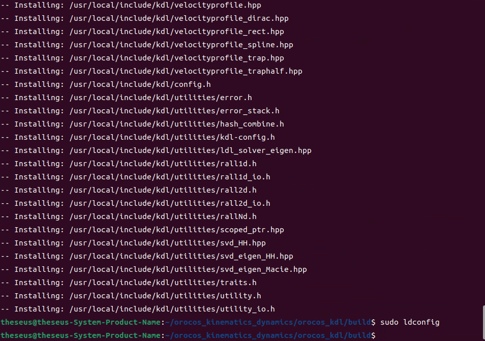
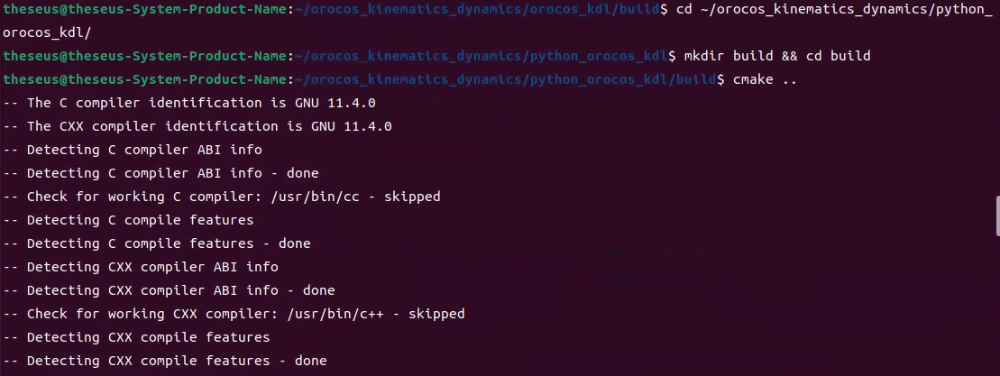
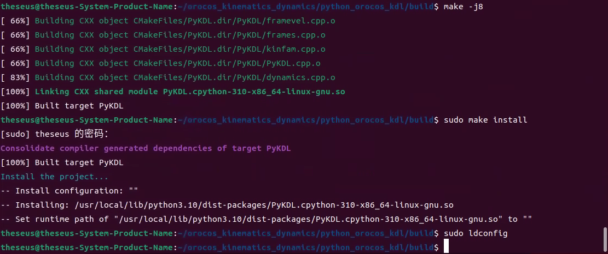
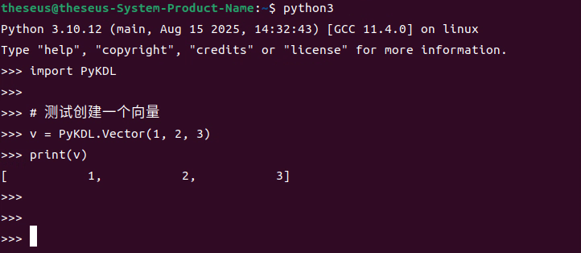

源代码github链接
https://github.com/orocos/orocos\_kinematics\_dynamics


注：

如果使用conda进行包管理，可以直接使用安装命令：

```plain&#x20;text
conda install -c conda-forge orocos-kdl python-orocos-kdl
```


不使用conda情况下，可以源码安装：

1. 在合理路径下（如家目录 \~ ）执行以下命令，拉取源代码

```plain&#x20;text
git clone https://github.com/orocos/orocos_kinematics_dynamics
```

出现以下，拉取成功




进入拉取的源码下，执行以下，拉取pybind11绑定模块

```plain&#x20;text
cd orocos_kinematics_dynamics
git submodule update --init --progress
```

出现




* 进入源码对应路径，PyKDL 依赖 C++ KDL 库，所以此时先进入C++源码部分编译安装,执行：

```plain&#x20;text
cd orocos_kinematics_dynamics/orocos_kdl
mkdir build && cd build
cmake ..
make -j8
sudo make install
sudo ldconfig
```

流程可参考如下图所示：











* 安装PyKDl，编译 Python 绑定，需要先回到源码对应的路径下，执行以下命令：

```plain&#x20;text
# 注意路径 #
cd ~/orocos_kinematics_dynamics/python_orocos_kdl/
mkdir build && cd build
cmake ..
make -j8
sudo make install
sudo ldconfig
```

流程可参考下图所示：






* 验证，在终端输入

```plain&#x20;text
python3

import PyKDL
v = PyKDL.Vector(1, 2, 3)
print(v)
```

有正常输出如：



安装成功
